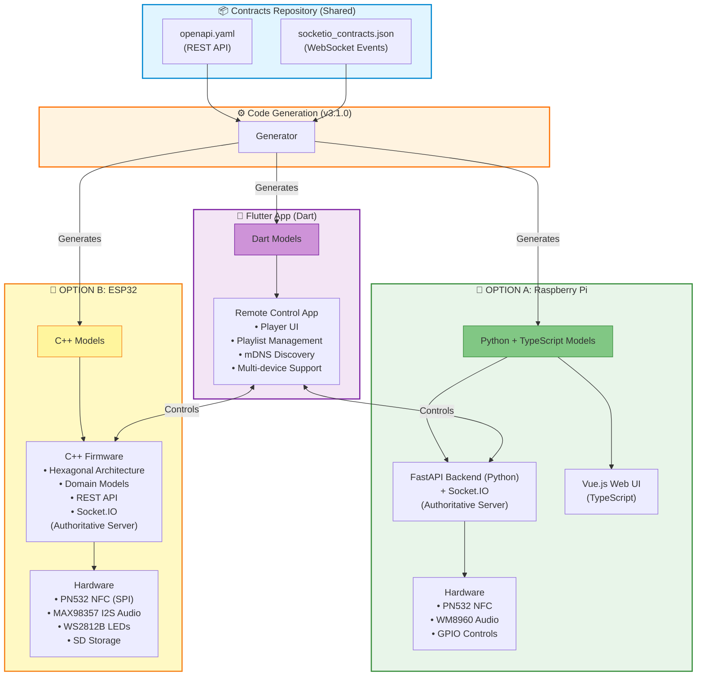

# TheOpenMusicBox - Project Architecture

<a href="https://www.buymeacoffee.com/rhy6j5cdpq9" target="_blank"></a>


[](LICENSE)
[](https://github.com/theopenmusicbox/contracts)

### 🔧 Technologies

**Backend (RPI):**

[](https://www.python.org/)
[](https://fastapi.tiangolo.com/)
[](https://socket.io/)
[](https://www.sqlite.org/)
[](https://www.pygame.org/)
[](https://docs.pydantic.dev/)
[](https://pytest.org/)

**Frontend (RPI Web UI):**

[](https://vuejs.org/)
[](https://pinia.vuejs.org/)
[](https://vitejs.dev/)
[](https://axios-http.com/)
[](https://www.typescriptlang.org/)

**Mobile App (Flutter):**

[](https://flutter.dev/)
[](https://dart.dev/)
[](https://pub.dev/packages/provider)
[](https://pub.dev/packages/dio)

**Embedded (ESP32):**

[](https://isocpp.org/)
[](https://www.arduino.cc/)
[](https://platformio.org/)
[](https://docs.espressif.com/projects/esp-idf/)

**API & Contracts:**

[](https://www.openapis.org/)
[](https://json-schema.org/)
[](https://socket.io/)

**Platforms:**

[](https://www.raspberrypi.org/)
[](https://www.espressif.com/en/products/socs/esp32-s3)

**DevOps & Tools:**

[](https://git-scm.com/)
[](https://github.com/)
[](https://www.docker.com/)
[](https://systemd.io/)

---

**Version:**
**Status:** Active Development

---

## 📋 Executive Summary

**TheOpenMusicBox** is an NFC-controlled music player system designed for children, providing a screen-free, tangible audio experience. The system offers **two alternative hardware implementations**: a **Raspberry Pi-based reference backend** with a **Vue.js web interface**, and a **standalone ESP32-based embedded player** — both controlled remotely via a **cross-platform Flutter mobile app** and coordinated through a **unified contract system**.

### Key Features

- **Tangible Interaction**: Physical NFC tags trigger playlists instantly
- **Dual Hardware Options**: Choose between Raspberry Pi (full-featured) or ESP32 (standalone embedded)
- **Multi-Platform Control**: Web UI (RPI only), Flutter app (works with both RPI and ESP32)
- **Real-Time Synchronization**: WebSocket-based state management with server-authoritative architecture
- **Contract-Driven Development**: OpenAPI 3.0 + Socket.IO contracts ensure type safety across all implementations
- **Hardware Abstraction**: Clean separation between business logic and hardware drivers (NFC, Audio, GPIO)

---

## 🏗️ System Architecture



**Note:** Choose EITHER RPI or ESP32 - they are alternative implementations, not meant to run together. The Flutter app works as a universal remote for both options.

---

## 📦 Repository Structure

### 1. `contracts/` - Single Source of Truth

**Purpose**: Canonical API and event definitions, with code generation for all languages

```
contracts/
├── schemas/
│   ├── openapi.yaml              # REST API specification (OpenAPI 3.0)
│   └── socketio_contracts.json   # Socket.IO event contracts (JSON Schema)
├── generated/                     # Auto-generated (gitignored)
│   ├── dart/                     # For Flutter app
│   ├── cpp/                      # For ESP32 firmware
│   ├── typescript/               # For web frontend
│   └── python/                   # For backend validation
├── releases/                      # Versioned releases (committed)
│   └── 3.1.0/
│       ├── dart/
│       ├── cpp/
│       ├── typescript/
│       └── python/
└── scripts/
    └── generate-all.sh           # Code generation pipeline
```

**Key Contracts (v3.1.0)**:
- **REST API**: 30+ endpoints (Player, Playlists, NFC, System, YouTube, Uploads)
- **Socket.IO Events**: 15+ real-time events (state updates, operation acknowledgments)
- **Data Models**: PlayerState, Track, Playlist, NFCAssociation, SystemInfo, UploadSession
- **Versioning**: Semantic versioning (MAJOR.MINOR.PATCH)

**Workflow**:
1. Edit `schemas/openapi.yaml` or `socketio_contracts.json`
2. Run `npm run generate` → generates clients for all languages
3. Commit versioned release (e.g., `releases/3.1.0/`)
4. Other repos consume via Git submodules

---

### 2. `rpi-firmware/` - Reference Backend Implementation

**Purpose**: Production Raspberry Pi firmware with web UI (server-authoritative architecture)

```
rpi-firmware/
├── back/                         # Python/FastAPI backend
│   ├── app/
│   │   ├── src/
│   │   │   ├── core/
│   │   │   │   ├── application.py           # Main orchestrator
│   │   │   │   ├── service_container.py     # Dependency injection
│   │   │   │   └── playlist_controller.py   # Coordination
│   │   │   ├── services/
│   │   │   │   ├── state_manager.py         # Server-authoritative state
│   │   │   │   ├── playlist_service.py      # Playlist business logic
│   │   │   │   ├── nfc_service.py           # NFC management
│   │   │   │   └── track_management_service.py
│   │   │   ├── routes/
│   │   │   │   ├── playlist_routes_state.py # HTTP endpoints
│   │   │   │   ├── player_routes.py
│   │   │   │   └── websocket_handlers_state.py # Socket.IO handlers
│   │   │   ├── module/                      # Hardware abstraction
│   │   │   │   ├── audio_player/            # pygame/ALSA
│   │   │   │   ├── nfc/                     # PN532 driver
│   │   │   │   └── controles/               # GPIO buttons/encoder
│   │   │   └── model/                       # Data models
│   │   └── data/                            # Playlists, audio files, DB
│   ├── tests/                               # 1500+ tests
│   └── requirements/                        # Dependency management
│       ├── base.txt
│       ├── dev.txt
│       ├── prod.txt
│       └── test.txt
├── front/                        # Vue.js 3 web UI
│   ├── src/
│   │   ├── components/
│   │   ├── views/
│   │   ├── stores/               # Pinia state management
│   │   └── services/             # API/Socket.IO clients
│   └── dist/                     # Build output (served by backend)
├── contracts/ (submodule)        # Links to contracts repo
├── deploy.sh                     # Automated deployment
└── setup.sh                      # On-device setup
```

**Technology Stack**:
- **Backend**: Python 3.9+, FastAPI, Socket.IO, SQLite, pygame (audio), RPi.GPIO
- **Frontend**: Vue.js 3, Pinia, Socket.IO Client, Axios, Vite
- **Hardware**: Raspberry Pi 3/4/5, WM8960 Audio HAT, PN532 NFC Reader

**Key Features**:
- **Server-Authoritative State**: Single source of truth for all state
- **Event Sequencing**: `server_seq` numbers prevent race conditions
- **Client Operation Tracking**: `client_op_id` for operation acknowledgment
- **Real-Time Sync**: WebSocket broadcasts for all state changes
- **Hardware Abstraction**: Mock implementations for development
- **Contract Validation**: 96% compliance with OpenAPI spec

---

### 3. `flutter_app/` - Cross-Platform Mobile Application

**Purpose**: Universal remote control app (works with both RPI and ESP32 implementations)

```
flutter_app/
├── lib/
│   ├── app/
│   │   └── main_app.dart         # App initialization
│   ├── core/
│   │   ├── api/                  # Generated API clients
│   │   ├── network/              # HTTP/WebSocket infrastructure
│   │   ├── storage/              # Local persistence
│   │   └── theme/                # UI theming
│   ├── features/
│   │   ├── player/               # Player control feature
│   │   │   ├── data/             # API datasources, repositories
│   │   │   ├── domain/           # Business logic, entities
│   │   │   └── presentation/     # UI screens, widgets
│   │   ├── playlist/             # Playlist management
│   │   ├── nfc/                  # NFC association
│   │   ├── upload/               # File upload (chunked)
│   │   └── discovery/            # mDNS device discovery
│   └── shared/                   # Common widgets/utilities
├── contracts/ (submodule)        # Links to contracts repo
├── pubspec.yaml                  # Dependencies
└── scripts/
    └── verify_and_launch.sh      # Testing & launch
```

**Technology Stack**:
- **Framework**: Flutter 3.5+, Dart 3.0+
- **State Management**: Provider pattern
- **Networking**: Dio (HTTP), Socket.IO Client
- **Architecture**: Clean Architecture (data/domain/presentation layers)

**Key Features**:
- **Universal Compatibility**: Works with both RPI and ESP32 backends
- **Multi-Device Support**: Discover and manage multiple music boxes on the network
- **mDNS Discovery**: Automatic device detection (both RPI and ESP32)
- **Real-Time Updates**: Socket.IO integration for live state sync
- **Chunked Upload**: Large file upload with progress tracking
- **Room Subscriptions**: Join/leave playlist-specific Socket.IO rooms
- **Type Safety**: Uses generated Dart models from contracts

**Current Status**:
- **API Coverage**: 49% (15/30 endpoints implemented)
- **Socket.IO Coverage**: 31% (5/16 events implemented)
- **Contract Usage**: Manual models (migration to generated models in progress)

---

### 4. `esp32-firmware/` - Embedded Hardware Alternative

**Purpose**: Standalone ESP32 music box (complete alternative to Raspberry Pi)

**To be announced**

---

## 🔄 API & Event Contracts (v3.1.0)

### REST API Endpoints (30 total)

#### **Health & System** (4 endpoints)
```yaml
GET  /api/health           # System health check
GET  /api/system/info      # System information
GET  /api/system/logs      # System logs
POST /api/system/restart   # Restart system
```

#### **Player Control** (7 endpoints)
```yaml
GET  /api/player/status    # Get current player state
POST /api/player/play      # Resume playback
POST /api/player/pause     # Pause playback
POST /api/player/stop      # Stop playback
POST /api/player/next      # Skip to next track
POST /api/player/previous  # Skip to previous track
POST /api/player/toggle    # Toggle play/pause
POST /api/player/seek      # Seek to position
POST /api/player/volume    # Set volume (0-100)
```

#### **Playlist Management** (8 endpoints)
```yaml
GET    /api/playlists                       # List all playlists (paginated)
POST   /api/playlists                       # Create playlist
GET    /api/playlists/{id}                  # Get playlist details
PUT    /api/playlists/{id}                  # Update playlist
DELETE /api/playlists/{id}                  # Delete playlist
POST   /api/playlists/{id}/start            # Start playlist playback
POST   /api/playlists/{id}/reorder          # Reorder tracks
DELETE /api/playlists/{id}/tracks           # Remove tracks
POST   /api/playlists/move-track            # Move track between playlists
POST   /api/playlists/sync                  # Sync playlist state
```

#### **Chunked File Upload** (5 endpoints)
```yaml
POST   /api/playlists/{id}/uploads/session              # Initialize upload session
PUT    /api/playlists/{id}/uploads/{sid}/chunks/{idx}   # Upload chunk
POST   /api/playlists/{id}/uploads/{sid}/finalize       # Finalize upload
GET    /api/playlists/{id}/uploads/{sid}                # Get upload status
GET    /api/uploads/sessions                            # List all upload sessions
DELETE /api/uploads/sessions/{sid}                      # Delete session
POST   /api/uploads/cleanup                             # Cleanup stale sessions
```

#### **NFC Management** (3 endpoints)
```yaml
POST   /api/nfc/associate       # Associate tag with playlist
DELETE /api/nfc/associate/{id}  # Remove association
GET    /api/nfc/status          # NFC reader status
POST   /api/nfc/scan            # Initiate NFC scan
```

#### **YouTube Integration** (3 endpoints)
```yaml
POST /api/youtube/download       # Download from YouTube
GET  /api/youtube/search         # Search YouTube
GET  /api/youtube/status/{id}    # Get download status
```

---

### Socket.IO Events (16 total)

#### **Server → Client (State Updates)**

```typescript
// Connection Events
'connect' | 'disconnect' | 'connection_status'

// Player State
'state:player' → {
  is_playing: boolean
  active_playlist_id: string | null
  active_track: Track | null
  position_ms: number
  duration_ms: number | null
  volume: number | null
  can_prev: boolean
  can_next: boolean
  server_seq: number
}

// Playlist State
'state:playlists' → PlaylistSummary[]  // Global list
'state:playlist' → PlaylistDetailed     // Individual playlist
'state:playlist_created' → PlaylistSummary
'state:playlist_deleted' → { playlist_id: string }
'state:playlist_updated' → { playlist_id: string, title?: string }

// Track Events
'state:track_added' → { playlist_id: string, track: Track }
'state:track_deleted' → { playlist_id: string, track_numbers: number[] }
'state:track_progress' → { position_ms: number }

// Upload Events
'upload:progress' → { session_id: string, progress: number }
'upload:complete' → { session_id: string, track: Track }
'upload:error' → { session_id: string, error: string }

// Operation Acknowledgments
'ack:op' → { client_op_id: string, success: boolean, server_seq: number }
'err:op' → { client_op_id: string, error: string }
```

#### **Client → Server (Commands)**

```typescript
// Room Management
'join:playlist' ← { playlist_id: string }
'leave:playlist' ← { playlist_id: string }

// Player Commands (optional, can use HTTP instead)
'cmd:play' ← { client_op_id?: string }
'cmd:pause' ← { client_op_id?: string }
'cmd:next' ← { client_op_id?: string }
'cmd:seek' ← { position_ms: number }
```

---

### Data Models

#### **PlayerState** (Core State)
```yaml
PlayerState:
  is_playing: boolean
  active_playlist_id: string | null
  active_playlist_title: string | null
  active_track: Track | null
  active_track_number: integer | null
  active_track_title: string | null
  track_index: integer | null              # 0-based index
  track_count: integer | null
  position_ms: integer                     # Current position
  duration_ms: integer | null              # Track duration
  can_prev: boolean
  can_next: boolean
  volume: integer | null (0-100)
  server_seq: number                       # Sequence for ordering
```

#### **Track**
```yaml
Track:
  number: integer                          # Track number in playlist
  title: string
  filename: string
  file_path: string
  duration: integer | null                 # DEPRECATED: Use duration_ms
  duration_ms: integer | null              # Preferred (milliseconds)
  artist: string | null
  album: string | null
  file_size: integer | null
  created_at: datetime
  updated_at: datetime
```

#### **PlaylistSummary** (Lightweight)
```yaml
PlaylistSummary:
  id: string
  title: string
  track_count: integer
  nfc_tag_id: string | null
  server_seq: number
  created_at: datetime
  updated_at: datetime
```

#### **PlaylistDetailed**
```yaml
PlaylistDetailed:
  id: string
  title: string
  description: string | null
  tracks: Track[]
  nfc_tag_id: string | null
  server_seq: number
  created_at: datetime
  updated_at: datetime
  total_duration_ms: integer
```

---

## 🔐 State Management & Synchronization

### Server-Authoritative Architecture

**Principle**: The backend (RPI or ESP32) is the **single source of truth**. Clients **never directly mutate state** — they request operations, and the server broadcasts authoritative updates.

#### Flow

```
1. Client sends HTTP request with client_op_id
   POST /api/playlists/sync
   { "client_op_id": "uuid-123", "last_sync_seq": 41 }

2. Server processes operation, updates authoritative state

3. Server responds to HTTP request
   { "status": "success", "server_seq": 42, "client_op_id": "uuid-123" }

4. Server broadcasts state change via WebSocket
   'state:playlists' → { "data": [...], "server_seq": 42 }

5. All connected clients (including originator) receive update and apply
```

#### Event Sequencing

All state events include a `server_seq` number:
```typescript
interface StateEvent {
  event_type: string
  server_seq: number              // Monotonically increasing
  data: any
  timestamp: number
  playlist_id?: string            // For room filtering
}
```

**Benefits**:
- **Consistency**: All clients converge to same state
- **Order Guarantee**: Clients apply updates in correct order
- **Conflict Resolution**: Server state always wins
- **Offline Handling**: Clients can detect missed updates (sequence gaps)

#### Client Operation Tracking

```typescript
// Client sends HTTP request
{
  "client_op_id": "uuid-123",
  "title": "My Playlist"
}

// Server acknowledges via WebSocket
'ack:op' → { "client_op_id": "uuid-123", "success": true, "server_seq": 42 }

// OR error
'err:op' → { "client_op_id": "uuid-123", "error": "Playlist not found" }
```

---

## 🔌 Hardware Integration

### Raspberry Pi (Reference Implementation)

| Component | Model | Interface | Driver/Library |
|-----------|-------|-----------|----------------|
| **Board** | Raspberry Pi 3/4/5 | - | Raspbian Bullseye 64-bit |
| **Audio** | Waveshare WM8960 HAT | I2S | ALSA, pygame |
| **NFC** | PN532 Module | I2C (GPIO 2/3) | nfcpy, RPi.GPIO |
| **Controls** | Physical buttons | GPIO | RPi.GPIO |
| **Encoder** | Rotary encoder | GPIO (CLK, DT, SW) | RPi.GPIO |
| **LEDs** | LED HAT (optional) | GPIO/I2C | Custom driver |

**Deployment**:
- Automated via `deploy.sh` script
- Systemd service (`app.service`)
- mDNS hostname: `theopenmusicbox.local`
- Web UI: `http://theopenmusicbox.local:5004`

---

### ESP32-S3 (Embedded Implementation)

| Component | Model | Interface | Driver/Library |
|-----------|-------|-----------|----------------|
| **Board** | ESP32-S3 DevKit-C | - | Arduino/PlatformIO |
| **Audio** | MAX98357 I2S Amplifier | I2S (GPIO 15/16/17) | ESP-IDF I2S |
| **NFC** | PN532 Module | SPI (GPIO 10/11/12/13) | Custom adapter |
| **LEDs** | WS2812B Strip | GPIO 18 | NeoPixel/FastLED |
| **Storage** | MicroSD Card | SPI/SDMMC | SPIFFS/SD |

**Development**:
- Build: `pio run -e esp32s3`
- Upload: `pio run -e esp32s3 -t upload`
- Monitor: `pio device monitor -b 115200`
- Environments: `esp32s3`, `esp32s3_debug`, `esp32s3_hil`, `esp32s3_release`

**Memory Profile**:
- Free heap after init: **280KB+**
- RAM usage: <15% (37KB used)
- Flash usage: <30% (810KB used)

---

## 📊 Compliance Matrix

| Repository | REST API | Socket.IO | Contract Models | Grade |
|------------|----------|-----------|-----------------|-------|
| **contracts/** | 100% (30/30) | 100% (16/16) | ✅ Source of Truth | A+ |
| **rpi-firmware/** | 96% (29/30) | 94% (15/16) | ✅ Python (validation) | A |
| **flutter_app/** | 49% (15/30) | 31% (5/16) | ⚠️ Manual (migration pending) | C+ |
| **esp32-firmware/** | 85% (26/30) | 75% (12/16) | ⚠️ Custom (model integration pending) | B |
| **Overall** | **82%** | **78%** | **50%** | **B-** |

**Target**: 100% compliance (A+ grade) — see [HARMONIZATION_PLAN.md](HARMONIZATION_PLAN.md)

---

## 🚀 Development Workflows

### Contract Update Workflow

```bash
# 1. Edit contracts
cd /Users/jonathanpiette/github/theopenmusicbox/contracts
vim schemas/openapi.yaml

# 2. Generate all clients
npm run generate

# 3. Create versioned release
mkdir -p releases/3.1.0
cp -r generated/{dart,cpp,python,typescript} releases/3.1.0/

# 4. Commit & tag
git add .
git commit -m "feat(contracts): bump to v3.1.0"
git tag v3.1.0
git push origin main --tags
```

### Submodule Update Workflow

```bash
# Update RPI firmware contracts
cd /Users/jonathanpiette/github/theopenmusicbox/rpi-firmware/contracts
git fetch origin
git checkout v3.1.0
cd ..
git add contracts
git commit -m "chore: update contracts to v3.1.0"

# Repeat for flutter_app and esp32-firmware
```

### RPI Firmware Deployment

```bash
cd /Users/jonathanpiette/github/theopenmusicbox/rpi-firmware

# Full deployment (tests + build + upload + monitor)
./deploy.sh --prod tomb

# Quick deployment (skip tests)
./deploy.sh --prod tomb --skip-tests

# Monitor only
./deploy.sh --monitor tomb
```

### Flutter App Testing

```bash
cd /Users/jonathanpiette/github/theopenmusicbox/flutter_app

# Verify and launch
./scripts/verify_and_launch.sh

# Run tests only
flutter test

# Generate coverage
flutter test --coverage
```

### ESP32 Firmware Development

```bash
cd /Users/jonathanpiette/github/theopenmusicbox/esp32-firmware

# Build and upload
make esp32 && make upload

# Monitor serial output
make monitor

# Run tests (native environment)
make test

# Full validation
make ci-test
```

---

## 🎯 Feature Matrix

| Feature | RPI | ESP32 | Flutter | Status |
|---------|-----|-------|---------|--------|
| **Player Control** | ✅ | ✅ | ✅ | Complete |
| **Playlist CRUD** | ✅ | ✅ | ⚠️ | Partial (Flutter) |
| **NFC Association** | ✅ | ✅ | ⚠️ | Partial (Flutter) |
| **Chunked Upload** | ✅ | ⚠️ | ❌ | In Progress |
| **Real-Time Sync** | ✅ | ✅ | ⚠️ | Partial (Flutter) |
| **mDNS Discovery** | ✅ | ✅ | ✅ | Complete |
| **YouTube Download** | ✅ | ❌ | ❌ | RPI Only |
| **Multi-Device Support** | N/A | N/A | ✅ | Flutter Only |
| **Physical Controls** | ✅ (GPIO) | ✅ (I2S) | N/A | Hardware Only |

---

## 📈 Roadmap

- TODO
---

## 📚 Documentation

- **Contracts**: [contracts/README.md](contracts/README.md)
- **RPI Backend**: [rpi-firmware/back/README.md](rpi-firmware/back/README.md)
- **RPI Deployment**: [rpi-firmware/DEPLOY_GUIDE.md](rpi-firmware/DEPLOY_GUIDE.md)
- **ESP32 Development**: [esp32-firmware/DEVELOPMENT.md](esp32-firmware/DEVELOPMENT.md)
- **ESP32 Integration**: [esp32-firmware/INTEGRATION_CHECKLIST.md](esp32-firmware/INTEGRATION_CHECKLIST.md)
- **Flutter App**: [flutter_app/README.md](flutter_app/README.md)
- **Harmonization Plan**: [HARMONIZATION_PLAN.md](HARMONIZATION_PLAN.md)
- **Contract Compliance**: [CONTRACT_COMPLIANCE_REPORT.md](CONTRACT_COMPLIANCE_REPORT.md)

---

## 🤝 Contributing

Contributions are welcome!
See individual repository READMEs for contribution guidelines.

---

## 📄 License

**Open Source with Reserved Commercial Rights**

- ✅ **Free for non-commercial use**: Use, modify, distribute freely
- ✅ **Open contributions**: Pull requests welcome
- ⚠️ **Commercial use reserved**: Monetization requires licensing from original author (Jonathan Piette)

See [LICENSE](LICENSE) for full terms.

---

## 📧 Contact

**Jonathan Piette** - Creator & Maintainer

- 🐙 GitHub: [@jonathanpiette](https://github.com/jonathanpiette)
- 📧 Email: contact@theopenmusicbox.com
- 💬 Issues: [GitHub Issues](https://github.com/theopenmusicbox)

## 🙏 Special Thanks
- [@Lynerah](https://github.com/lynerah) for web developement, modelisation
---

**Generated:** 2025-10-10
**Last Updated:** 2025-10-10
**Version:** 1.0.0
**Status:** 🟢 Active Development
